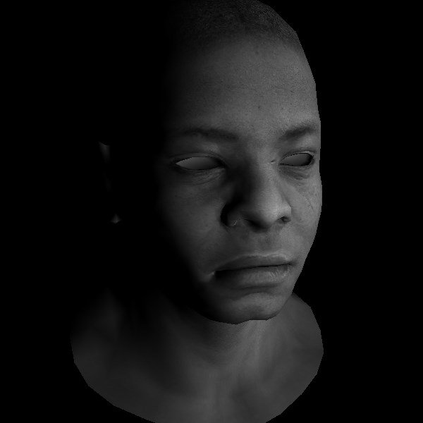
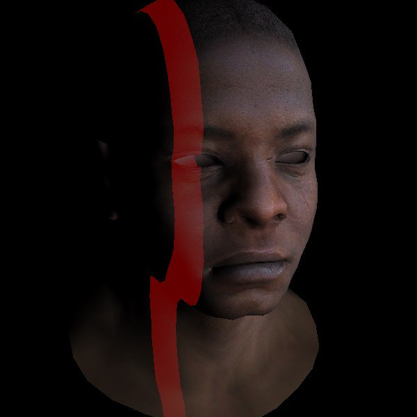
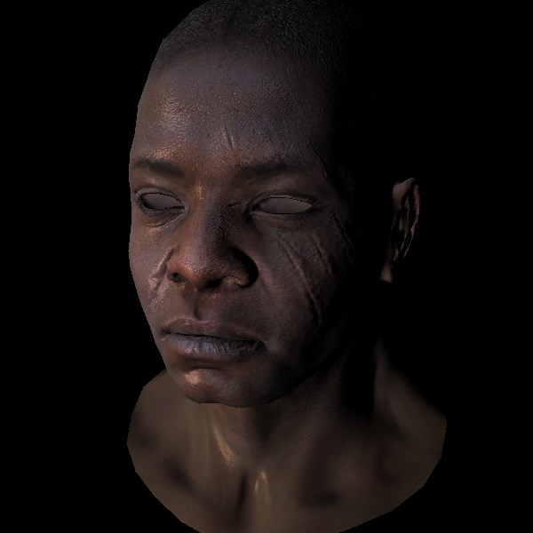

# SoftwareRenderer
Doing a software renderer for learning purposes following a tutorial.

You can find the tutorial here and try it yourself:

https://github.com/ssloy/tinyrenderer

I tried to write as much of the code as possible following the principles explained there without peeking and copying the resulting code that is offered. The main difference to the tutorial code is that my code not only writes the results into a TGA file but also draws it on the screen using SDL2 which makes iteration times faster. You can get SDL here:

https://www.libsdl.org/

My code is not optimized. I do not know for example if drawing single pixels through SDL is faster than with WINAPI (probably not). I use SDL because it faster to write. The same applies to the rest of the code. It only serves for me to understand 3D software rendering and is not production ready in any way.

Examples for the current state with virtual shaders:

   
